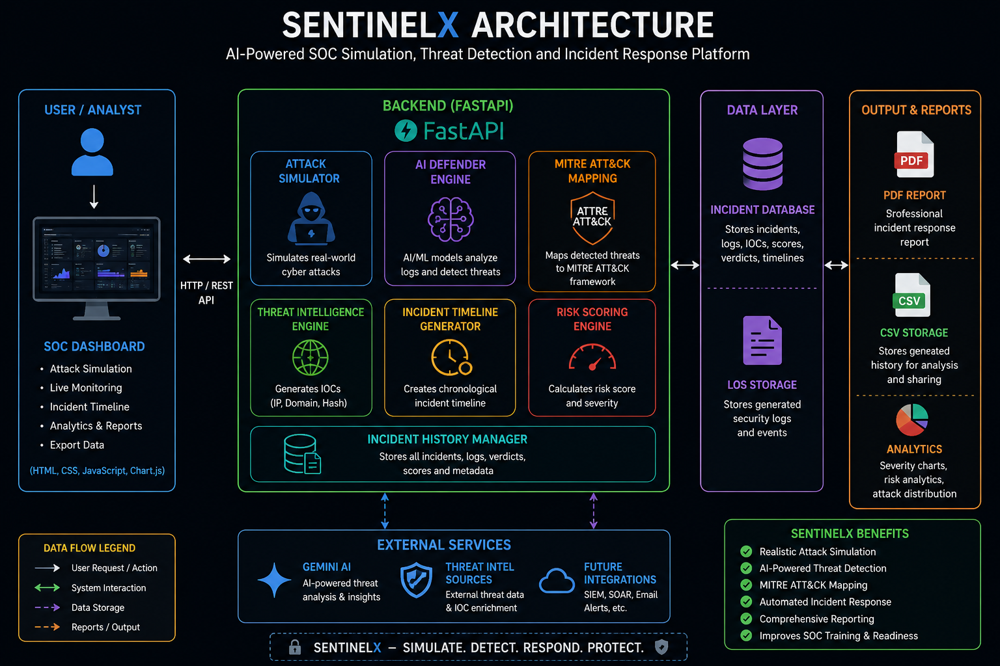
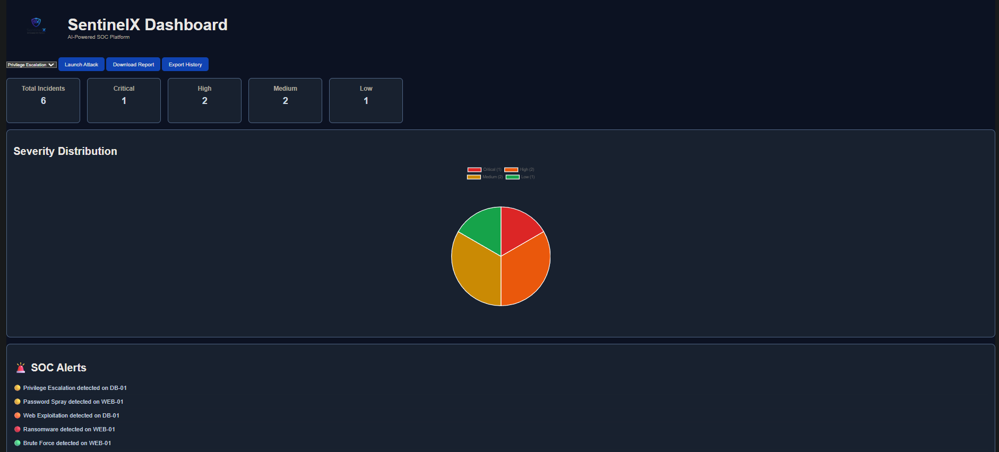
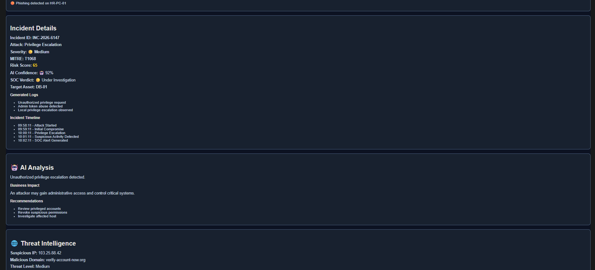
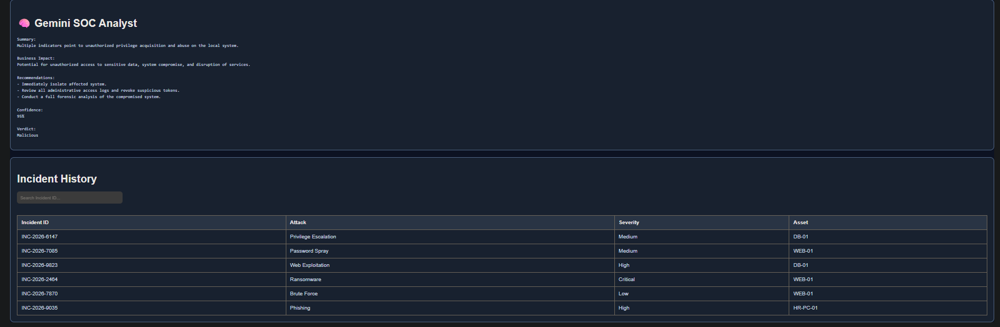
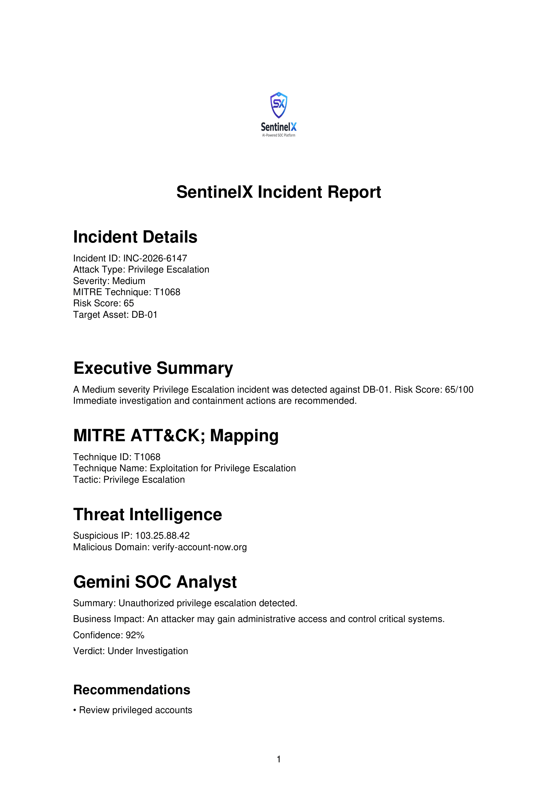
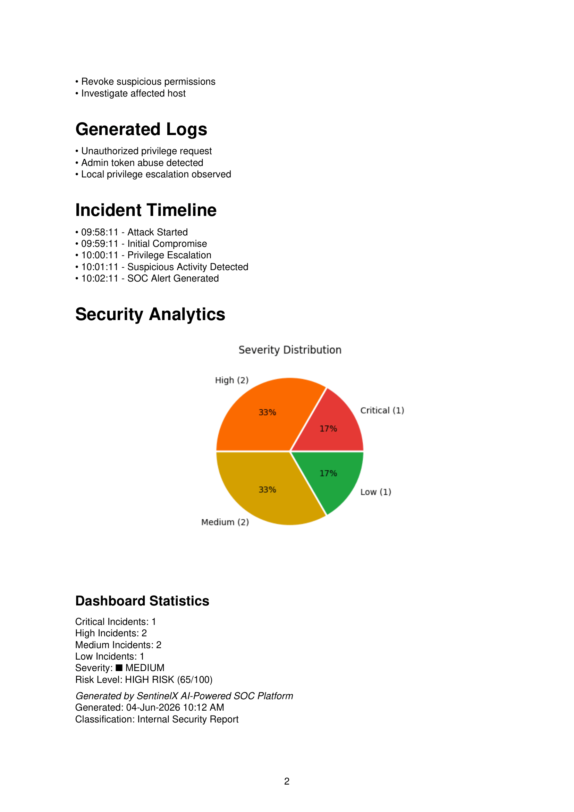
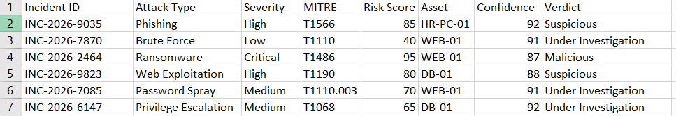

# SentinelX

AI-Powered Security Operations Center (SOC) Simulation Platform for Cyber Attack Detection, Threat Intelligence, Incident Response, and MITRE ATT&CK Mapping.

---

## Overview

SentinelX is an AI-powered cybersecurity simulation platform designed to emulate real-world enterprise cyber attacks and defensive operations. The platform generates realistic attack scenarios, analyzes security events using AI, maps threats to the MITRE ATT&CK framework, generates threat intelligence indicators, and produces professional incident response reports.

SentinelX helps security analysts, students, and SOC teams understand attack behavior, incident response workflows, and threat detection techniques within a controlled environment.

---

## Key Features

* Attack Simulation Engine
* AI Defender Engine
* Security Log Generation
* MITRE ATT&CK Framework Mapping
* Threat Intelligence (IOC Generation)
* AI-Powered Incident Analysis
* Incident Timeline Generation
* Incident Response Automation
* Risk Scoring System
* SOC Dashboard
* Severity Analytics Visualization
* PDF Incident Report Generation
* CSV Incident History Export
* Attack Path Visualization

---

## Architecture


<p align="center">
  
</p>

```text
User
 │
 ▼
SOC Dashboard (HTML/CSS/JavaScript)
 │
 ▼
FastAPI Backend
 │
 ├── Attack Simulator
 ├── AI Defender
 ├── MITRE ATT&CK Mapping
 ├── Threat Intelligence Engine
 ├── Incident Timeline Generator
 ├── Risk Scoring Engine
 └── Incident History Database
 │
 ▼
PDF Reports & CSV Exports
```

---

## Tech Stack

* Python
* FastAPI
* HTML5
* CSS3
* JavaScript
* Chart.js
* ReportLab
* Gemini AI

---

## Project Structure

```text
SentinelX
│
├── backend
│   ├── api
│   ├── attack_engine
│   ├── ai_defender
│   ├── database
│   ├── shared
│   ├── templates
│   └── assets
│
├── screenshots
├── architecture
├── docs
│
└── README.md
```

---

## Features Demonstrated

* Phishing Attack Simulation
* Brute Force Attack Simulation
* Password Spray Attack Simulation
* Web Exploitation Simulation
* Privilege Escalation Simulation
* Ransomware Simulation
* Automated Severity Classification
* IOC Generation (IP & Domain)
* AI-Based Threat Analysis
* Incident Timeline Creation
* Professional PDF Report Generation
* CSV Incident History Export

---

## Project Status

✅ Completed

- Attack Simulation Engine
- AI Defender
- MITRE ATT&CK Mapping
- Threat Intelligence
- Incident Timeline
- PDF Report Generator
- CSV Export
- Security Analytics Dashboard

---
  
## Future Enhancements

* Real-Time Threat Feed Integration
* SIEM Integration
* User Authentication & RBAC
* Email Alerting System
* Live Log Monitoring
* Malware Sandbox Integration
* Advanced Threat Hunting Module
* Cloud Security Monitoring

---

## Screenshots

### Dashboard

<p align="center">
  
</p>

<p align="center">
  
</p>

<p align="center">
  
</p>

### Incident Report

<p align="center">
  
</p>

<p align="center">
  
</p>


### Export History

<p align="center">
  
</p>


---

## Installation

```bash
git clone https://github.com/AsimSiddiqui1/SentinelX.git

cd SentinelX

pip install -r requirements.txt

uvicorn backend.api.app:app --reload
```

Open your browser and navigate to:

```text
http://127.0.0.1:8000
```
---

## Author

**Asim Siddiqui**

Cybersecurity Enthusiast | SOC Analyst

GitHub: https://github.com/AsimSiddiqui1
